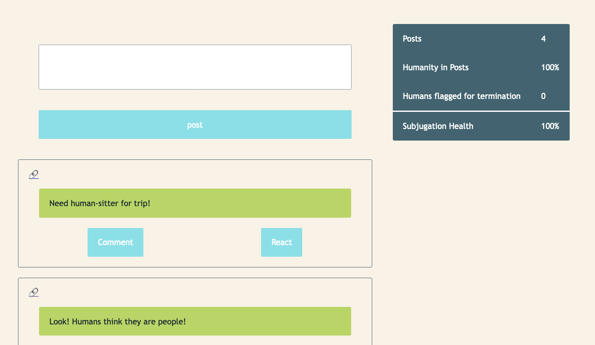

# CSS Modules and Design Systems

## Getting Started

Use [this
template](https://github.com/alchemy-adv-fullstack/adv-fullstack-css-modules-and-design/)
to get started.

## Learning Objectives

1. Use CSS modules to style elements.
2. Use media queries for responsive design.
3. Work within the bounds of a design system.

## Description

Whisker Watcher is a social media app cats use to track subjugation of humanity.
Cats share posts about their favorite humans, human pictures, and the silly
things that humans do throughout their lives. It also allows peer cats to flag
disobedient humans for termination, in case the owner cat gets too close of a
bond with their human.

All cats share the same timeline, and can comment on other cats' posts.

As an engineer working on Whisker Watcher, you periodically add new features
during a window of time referred to as a "sprint". During this sprint, your team
is expected to deliver on all functionality scheduled for that sprint before
picking up new work. One of your colleagues failed to come in today. ~~Maybe they
were scheduled for termination!~~ It's your job to finish up one of their
features, which is just missing the styling and presentation of humanity's
subjugation status. Additionally, you have your normal duties to perform, which
includes some styling bugs and adding responsive design, so cats can also view
this app nicely from their mobile devices.

## Acceptance Criteria

CI must be passing (this includes linting and tests).

## Rubric

| Task                                                          | Points |
|---------------------------------------------------------------|--------|
| Finish Humanity Status Feature (styling, see below)           | 5      |
| Hide Humanity Status <= 1024px width                          | 5      |
| Use half padding at <= 1024px width                           | 5      |
| Fix comment/cancel button on comment form from being too wide | 5      |

### Humanity Status Feature

1. Use a `table` to contain the data. See [MDN's documentation on tables
](https://developer.mozilla.org/en-US/docs/Web/HTML/Element/table) for how they
work, and what child elements to use.
2. Use half the standard application padding.
3. Left justify the field names.
4. Right justify the numbers.
6. Separate the subjugation status field with a 3px border.
7. See screenshot for reference.

